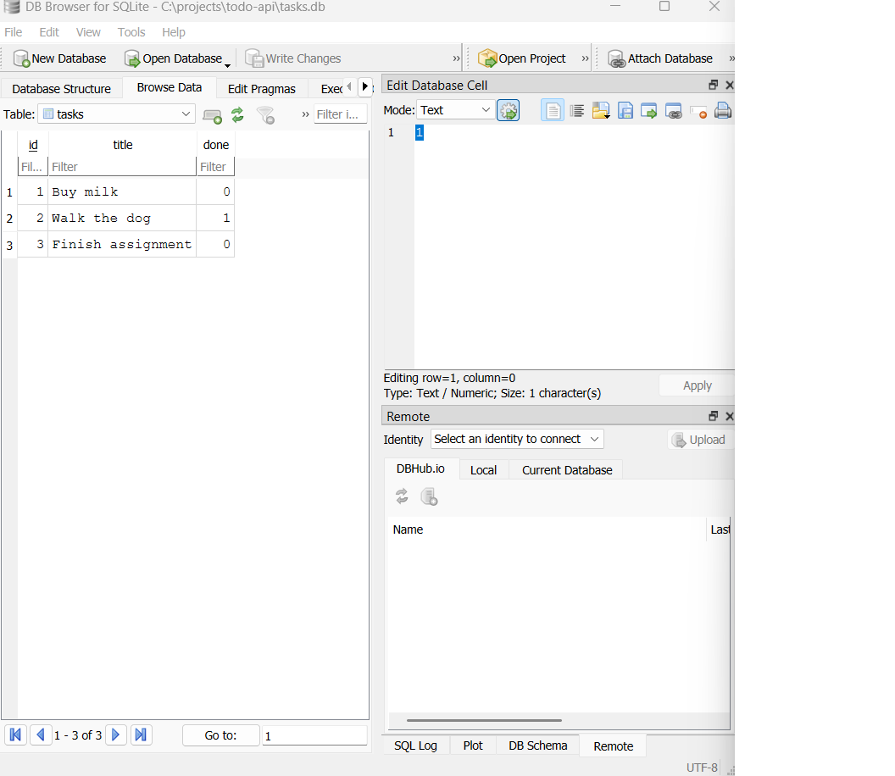

\# Task API

A small CRUD (Create, Read, Update, Delete) API for managing a to-do list, built with Node.js and Express. Data is stored in memory — it resets when the server restarts (no database yet).

\## How to run it

1\. Clone this repo and open a terminal in the project folder.

2\. Install dependencies: `npm install`

3\. Start the server: `node index.js`

4\. The API is now running at http://localhost:3000

5\. Interactive docs (Swagger UI) are at http://localhost:3000/docs

\## Endpoints

| Method | Path | Description |

|--------|------|-------------|

| GET | / | API info |

| GET | /health | Health check |

| GET | /tasks | List all tasks |

| GET | /tasks/:id | Get a single task by id |

| POST | /tasks | Create a new task |

| PUT | /tasks/:id | Update a task's title/done |

| DELETE | /tasks/:id | Delete a task |

## Why SQLite

SQLite was chosen because it needs no separate server to install — the whole database is a single file (`tasks.db`) that's created automatically the first time the app runs. This means data now survives a server restart, unlike the in-memory version from Assignment 1.

## Database

The database file `tasks.db` is created automatically in the project folder when the app first runs. It's listed in `.gitignore`, so each fresh clone starts with a clean database and reseeds the 3 example tasks automatically.

## Run it

1. `npm install`
2. `node index.js`
3. Visit http://localhost:3000/tasks

## Example SQL query (Stage 4)

I ran `DELETE FROM tasks WHERE done = 1;` in DB Browser for SQLite, which deleted all completed tasks and returned an empty result set. Refreshing the running API's `/tasks` endpoint immediately showed the change with no server restart — proving the API and DB Browser read the same underlying file.

## Database screenshot

\## Example request

`curl -X POST http://localhost:3000/tasks -H "Content-Type: application/json" -d "{\\"title\\":\\"Buy milk\\"}"`

Response: `{"id":4,"title":"Buy milk","done":false}`

\## Swagger UI

Swagger UI screenshot: swagger-screenshot.png

\## The mortality experiment

Restarting the server resets the task list back to the original 3 example tasks — anything created, updated, or deleted during a session is lost. This is because tasks are stored in a plain JavaScript array in memory, not in a database or file. As soon as the Node process stops, that memory is cleared. This is the exact limitation a real database solves.

